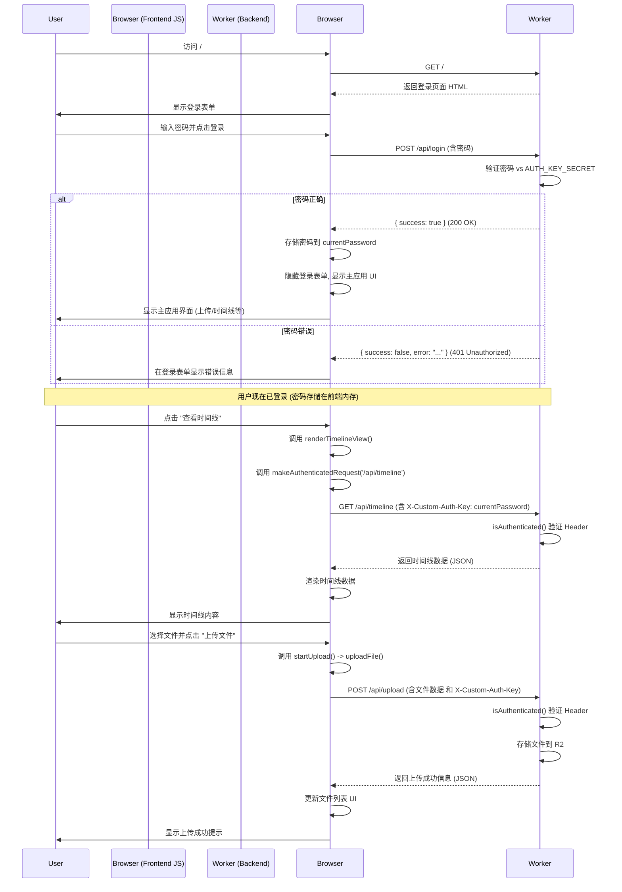

# CloudDrop 认证流程改进计划

## 问题背景

当前应用存在以下认证相关问题：
1.  时间线加载失败，提示认证错误。
2.  用户可以直接访问主应用页面，但在执行需要认证的操作（如加载时间线、上传）时才失败，因为没有预先输入密码。
3.  期望的流程是：用户必须先通过认证才能进入应用主界面，之后的所有操作都应自动获得授权。

## 新认证逻辑构思

为了实现“先认证，后访问”的流程，提议采用以下设计：

1.  **初始访问 (`/`)**：
    *   **后端 (Worker)**：访问根路径 `/` 时，返回一个**仅包含登录表单**的简化版 HTML 页面。
    *   **前端**：用户首先看到登录页面。

2.  **登录尝试 (`/api/login`)**：
    *   **前端**：用户输入密码并提交，通过 POST 请求将密码发送到新的 `/api/login` 端点。
    *   **后端 (Worker)**：创建 `/api/login` 路由处理 POST 请求。
        *   验证提交的密码与 `env.AUTH_KEY_SECRET`。
        *   成功则返回 `{ success: true }` (200 OK)。
        *   失败则返回 `{ success: false, error: "密码错误" }` (401 Unauthorized)。

3.  **登录成功后的前端处理**：
    *   **前端**：收到 `/api/login` 成功响应后：
        *   将密码存储在前端变量 `currentPassword` 中（仅限当前会话）。
        *   隐藏登录表单。
        *   **动态加载/显示主应用界面**（文件上传、时间线按钮、评论区等）。

4.  **后续 API 请求**：
    *   **前端**：调用 `makeAuthenticatedRequest` 函数。
    *   `makeAuthenticatedRequest` 从 `currentPassword` 获取密码，添加到 `X-Custom-Auth-Key` 请求头。
    *   **后端 (Worker)**：现有 API 端点 (`/api/upload`, `/api/timeline`, 文件 GET/DELETE) 继续使用 `isAuthenticated` 验证请求头。

## 流程示意图 (Mermaid Sequence Diagram)

## 总结

*   **入口分离：** 登录入口与主应用分开。
*   **状态管理：** 前端通过 `currentPassword` 管理登录状态。
*   **动态 UI：** 主应用界面登录成功后动态呈现。
*   **认证一致性：** 所有受保护 API 依赖登录凭证。